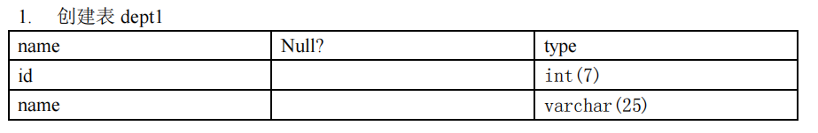
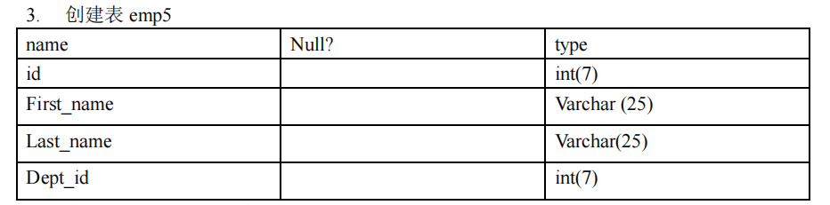

# 表的管理

### 表的创建

```SQL
create table 表名(
        列名  列的类型 【长度】【约束】,
        列名  列的类型 【长度】【约束】,
        列名  列的类型 【长度】【约束】,
        ...
        列名  列的类型 【长度】【约束】

) 
容错性处理
create table if not exists表名(
       ...
)


# eg:创建 book 表
create table book(
    id int ,     # 编号
    bName varchar(20),   # 图书名      # 这里的 20 代表最大长度
    price double,        # 价格
    authorId int,   # 作者编号
    publishDate datetime  # 出版日期
) 


```


### 表的修改

```SQL
语法：

alter table 表名 add | drop | modify | change |   
column  列名  【列类型】【约束】


1：修改列名
alter table 表名  change column 旧列名 新列名 类型;

# alter table book change column publishDate pubdate datetime;

2：修改列的类型或约束
alter table 表名  modify column 列名 新类型;

# alter table book  modify column pubdate timestamp;

3：添加新列
alter table 表名 add column 新列名 类型;
alter table 表名 add column 新列名 类型 【first | after 列名】;

# alter table book add column money  double;
# alter table book add column money1 int first;
# alter table book add column money2 int after money1; 

4：删除列
alter table 表名 drop column 列名;

# alter table book drop column money;

5：修改表名
alter table 表名 rename to 新表名
```


### 表的删除

```SQL
drop table 表名;

容错性处理
drop table if exists 表名; 
```


### 表的复制

```SQL
1: 仅复制表的结构
    create table  复制后创建的表名 like  原表名;

2：复制表的结构+ 所有数据
    create table  复制后创建的表名
    select * from  原表名;

3：复制表的结构+ 部分数据（主要由select 决定）
    create table 复制后创建的表名
    select id
    from book
    where nation = '中国';
    
4:仅复制某些字段(部分结构)
    create table 复制后创建的表名
    select id
    from book
    where 0;   # 这里就表示恒不成立，使得只会在新表中创建 id 这一个列，并且没有数据，达到部分复制

 
```




```SQL
create table dept1 (
        id,int(7),
        name,varchar(25)
);
```


```SQL
# 2. 将表 departments 中的数据插入新表 dept2 中 (跨库插入)

create table dept2;
select department_id,department_name
from myemployees.departments;
 
```




```SQL
create table emp5(
    id int(7),
    First_name varchar(25),
    Last_name varchar(25),
    Dept_id int(7)
);
```


```SQL
# 4. 将列 last_name 的长度增加到 50
alter table employees modify column last_name varchar(50);

# 5. 根据表 employees 创建 employees2
alter table employees2 like myemployees.employsees;

# 6. 删除表 emp5
drop table if exists emp5;

# 7. 将表 employees2 重命名为 emp5
alter table employees2 rename to emp5;

#  8 在表 dept 和 emp5 中添加新列 test_column，并检查所作的操作
alter table emp5 add column test_column;


# 9.直接删除表 emp5 中的列 dept_id 
alter table emp5 drop column dept_id;

```


