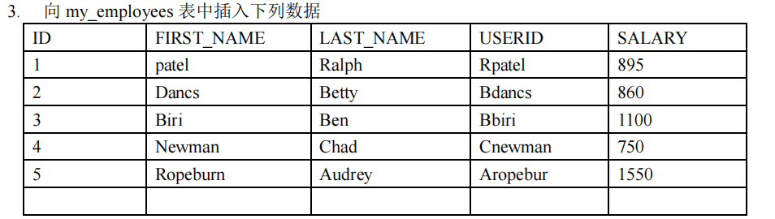
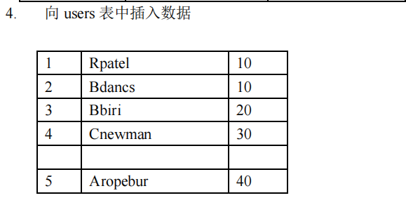

# 题目

```SQL
# 1. 运行以下脚本创建表 my_employees
Create table my_employees(
Id int(10),
First_name varchar(10),
Last_name varchar(10),
Userid varchar(10),
Salary double(10,2) )
create table users(
id int,
userid varchar(10),
department_id int
)

2. 显示表 my_employees 的结构
 
```




```SQL

```




```SQL
# 5. 将 3 号员工的 last_name 修改为“drelxer”
```


```SQL
# 6. 将所有工资少于 900 的员工的工资修改为 1000
```


```SQL
# 7. 将 userid 为 Bbiri 的 user 表和 my_employees 表的记录全部删除
```


```SQL
# 8. 删除所有数据
```


```SQL
# 9. 检查所作的修正
```


```SQL
# 10. 清空表 my_employees
```


