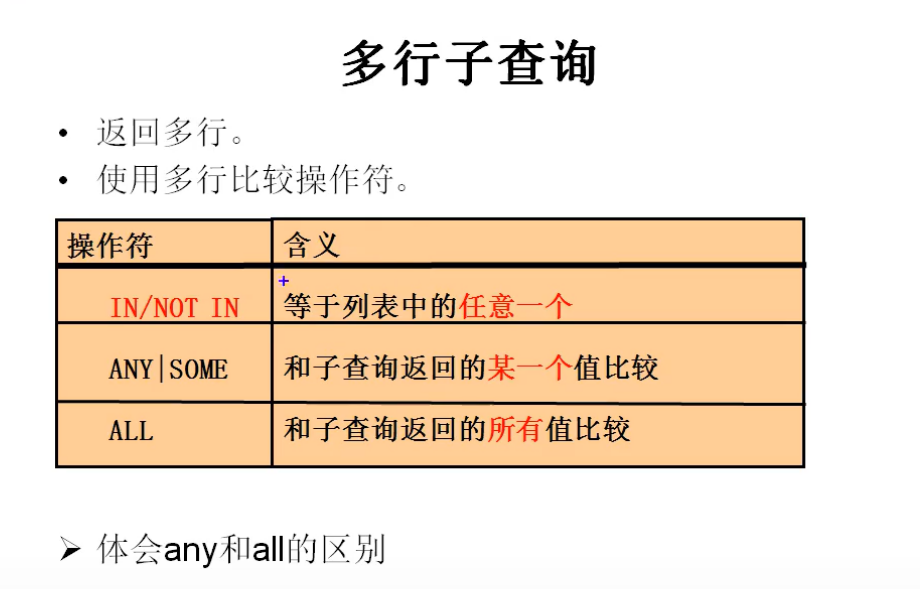

# 子查询

### 含义：

一条查询语句中又嵌套了另一条完整的select语句，其中被嵌套的select语句，称为子查询或内查询，在select外面的查询语句，称为主查询或外查询

### 分类

#### 按照子查询出现的位置：

1. select  后面   （只支持标量子查询）

2. from   后面      （支持表子查询）

3. where 或 having  后面    （标量子查询，列子查询，行子查询）

4. exists  后面 （相关子查询） （主要是表子查询，都可以）

#### 按结果集的行列数不同：

1. 标量子查询（结果只有一行一列）

2. 列子查询（一列多行）

3. 行子查询（一行多列） 

4. 表子查询（多行多列） 

### 特点

1、子查询都放在小括号内

2、子查询可以放在from后面、select后面、where后面、having后面，但一般放在条件的右侧

3、子查询优先于主查询执行，主查询使用了子查询的执行结果

4、子查询根据查询结果的行数不同分为以下两类：

① 单行子查询

&ensp;&ensp;&ensp;&ensp;结果集只有一行

&ensp;&ensp;&ensp;&ensp;一般搭配单行操作符使用：> < = <> >= <= 

&ensp;&ensp;&ensp;&ensp;非法使用子查询的情况：

&ensp;&ensp;&ensp;&ensp;a、子查询的结果为一组值

&ensp;&ensp;&ensp;&ensp;b、子查询的结果为空

② 多行子查询

&ensp;&ensp;&ensp;&ensp;结果集有多行

&ensp;&ensp;&ensp;&ensp;一般搭配多行操作符使用：any、all、in、not in

&ensp;&ensp;&ensp;&ensp;in： 属于子查询结果中的任意一个就行

&ensp;&ensp;&ensp;&ensp;any和all往往可以用其他查询代替



### 放在where后的查询

#### 单行子查询

```SQL
# where或 having 后面
# eg: 谁的工资比 Abel 高
# ①：先查 Abel 工资
select salary
from  employees
where last_name = 'Abel'

# ②：查询员工的信息，满足 salary > Abel （①）
select *
from employees
where saalry > (
        select salary
        from  employees
        where last_name = 'Abel'
)

 
# eg:返回 job_id 与 141 号员工相同，salary 比 143 号员工的多的员工的job_id 和 工资
# ①先查 141 号 job_id 的工资
select job_id
from employees
where employee_id = 141;

# ②：查询 143 号员工的 salary
select salary
from employees
where employee_id = 143;

# 查询员工的姓名  job_id 和 salary ，要求 job_id=①，salary>②
select last_name,
       job_id,
       salary
from
        employees
where salary >(
    select salary
    from employees
    where employee_id = 143
    )
and
      job_id = (
          select job_id
          from employees
          where employee_id = 141
        )     
        
 
# eg:返回公司工资最少的员工的 last_name ,job_id ,salary
# ①：先查最少工资
select min(salary)
from employees;

# ②：再查 last_name ,job_id
select last_name,
       job_id,
       salary
from employees
where salary = (
    select min(salary)
    from employees
    ); 
    
    
# eg:查询最低工资大于 50号部门 最低工资 的 部门id 和其最低工资
# ①：找 50号部门的最低工资
select min(salary)
from employees
where department_id = 50;

# ②：查询每个部门的最低工资
select min(salary),
       department_id
from employees
group by department_id;

# ②的基础上加 having
select min(salary),
       department_id
from employees
group by department_id
having min(salary) > (
    select min(salary)
    from employees
    where department_id = 50
    ); 
```


#### 列子查询（多行子查询）

```SQL
# eg:返回 location_id 是 1400 或 1700 的部门中的所有员工姓名
# ①
select distinct department_id
from departments
where location_id in (1400,1700);

# ②：
select last_name
from employees
where department_id
in (
    select distinct department_id
    from departments
    where location_id in (1400,1700)

          );
  
          
# in 可以替换成 = any   not in 可以替换成 <> all          
select last_name
from employees
where department_id
= any (
    select distinct department_id
    from departments
    where location_id in (1400,1700)

          );
          
          
          
# eg:返回其它工种中比job_id为‘IT_PROG’工种任一工资低的员工的员
# 工号、姓名、job_id 以及salary 
# ①：
select distinct salary
from employees
where job_id = 'IT_PROG';


# ②：
select job_id,
       salary,
       employee_id
from employees
where salary < any (
    select distinct salary
    from employees
    where job_id = 'IT_PROG'
)
and job_id  <> 'IT_PROG'; 


# 第二种
select job_id,
       salary,
       employee_id
from employees
where salary <  (
    select  max(salary)
    from employees
    where job_id = 'IT_PROG'
)
and job_id  <> 'IT_PROG'; 


# 返回其它部门中比job_id为‘IT_PROG’部门所有工资都低的员工
# 的员工号、姓名、job_id 以及salary 

select job_id,
       salary,
       employee_id
from employees
where salary < all (
    select distinct salary
    from employees
    where job_id = 'IT_PROG'
)
and job_id  <> 'IT_PROG'; 


select job_id,
       salary,
       employee_id
from employees
where salary <  (
    select  min(salary)
    from employees
    where job_id = 'IT_PROG'
)
and job_id  <> 'IT_PROG'; 
```


#### 行子查询

当多个条件相同的大于，小于或等于的关系时，就可以使用

```SQL
# eg:查询员工编号最小并且工资最高的员工信息
select min(employee_id)
from employees;

# 查询最高工资
select max(salary)
from employees; 

select *
from employees
where employee_id =(
    select min(employee_id)
    from employees
    )
and  salary=(
    select max(salary)
    from employees
    ); 
    
# 上述条件中有两个相等的条件，这样的可以使用行子查询来代替

 select *
from employees
where (employee_id ,salary) = (
    select min(employee_id),max(salary)
    from employees
    );

```


### 放在 select 后面的查询

结果都是一行一列（即仅支持标量子查询）

```SQL
# 查询每个部门的员工个数

use myemployees;
select d.*,(
    select count(*)
    from employees as e
    where d.department_id = e.department_id
    ) as 员工个数
from departments as d


# eg:查询员工号 =102 的部门编号
select (
    select department_name
    from departments as d
    inner join employees e on d.department_id = e.department_id
    where e.employee_id = 102
           ) as 部门名;

```


### 放在 from 后面

```SQL
# 查询每个部门的平均工资的工资等级
# ①：计算每个部门的平均工资
select avg(salary),
       department_id
from employees
group by department_id;

# ②：连接①的结果集和 job_grades 表，筛选条件是平均工资 between lowest_sal and highest_sal
select ag_dep.*,
       g.grade_level
from(
    select avg(salary) as ag,
       department_id
from employees
group by department_id
        )  as ag_dep    # 这里要注意的时我们必须起别名
inner join job_grades as g
on ag_dep.ag between lowest_sal and highest_sal;
```


### 放在 exists 后面

```SQL
# exists 是指是否存在的意思，有返回 1（true），
# 无则返回 0 （false）
# 查询结果只有 1 和 0 
# eg:查询不可能出现的工资
select exists(select employee_id from employees where salary = 40000);
  
  
  
# eg:查询有员工的部门名
select
        last_name,
       d.department_id
from employees as e
inner join departments d on e.department_id = d.department_id
group by department_name;


select department_name
from departments as d
where exists(
    select *
    from employees as e
    where d.department_id = e.department_id
          ); 
          
select department_name
from departments as d 
where d.department_id in(
    select department_id
    from employees
    ); 
    
    
    
# 查询没有女朋友的男神信息
use girls;
select bo.*
from boys as bo
where bo.id not in (
    select boyfriend_id
    from beauty
    );

select bo.*
from boys as bo
where not exists(
    select boyfriend_id
    from beauty as b
    where bo.id = b.boyfriend_id
)
 
```


### 题目

```SQL
# 1. 查询工资最低的员工信息: last_name, salary
select min(salary)
from employees;

select last_name,salary
from employees
where salary = (
    select min(salary)
    from employees
);

 
```


```SQL
# 2. 查询平均工资最低的部门信息
# 方式一： 多次子查询嵌套
# ①：先查所有部门的平均工资
select avg(salary),department_id
from  employees
group by department_id;
# ②：查找工资最低的部门
select avg(salary),department_id
from  employees
group by department_id
having avg(salary) = (

    select min(ag)
    from (
      select avg(salary) as ag,department_id
      from  employees
      group by department_id
    )as ag_dep
)
# ③：查询部门信息
select d.*
from departments as d
where d.department_id = (
    select department_id
    from  employees
    group by department_id
    having avg(salary) = (
    
        select min(ag)
        from (
          select avg(salary) as ag,department_id
          from  employees
          group by department_id
        )as ag_dep
    )
)

# 方式二 ，使用分页查询
# ①：先查最低工资的部门
select department_id
from  employees
group by department_id
order by avg(salary)
limit 1;

# ②：查询部门信息
select *
from departments
where department_id = (
  select department_id
  from  employees
  group by department_id
  order by avg(salary)
  limit 1
);


# 方式三：使用内连
select d.*
from  departments as d
inner join (
      select avg(salary),department_id
      from  employees as e
      group by department_id
      order by avg(salary)
      limit 1
)as ag_dep
on d.department_id = ag_dep.department_id;

 
```


```SQL
# 3. 查询平均工资最低的部门信息和该部门的平均工资
# 方式二
# ①：先查所有部门的平均工资
select avg(salary),department_id
from  employees
group by department_id;

# ②：先查最低工资的部门
select department_id
from  employees
group by department_id
order by avg(salary)
limit 1;

# ③：查询部门信息
select d.*,ag
from departments as d
inner join(
      select avg(salary) as ag,department_id
      from  employees
      group by department_id
      order by avg(salary)
      limit 1
)as ag_dep
on d.department_id = ag_dep.department_id


```


```SQL
# 4. 查询平均工资最高的 job 信息
# 先查最高的job的平均工资
select avg(salary),job_id
from employees
group by job_id;
order by avg(salary) desc
limit 1

# 查询job信息
select *
from jobs
where job_id = (
    select job_id
    from employees
    group by job_id
    order by avg(salary) desc
    limit 1

)
```


```SQL
# 5. 查询平均工资高于公司平均工资的部门有哪些?
# 方式一
# ①：查每个部门的平均工资
select avg(salary)
from employees
group by demployee_id

# ②：筛选满足 ① 的结果集，满足平均工资 > ①
select  avg(salary),department_id
from employees
group by department_id
having avg(salary) > (
  select avg(salary)
  from employees
  group by demployee_id
)


# 方式二：使用内连接，可以查到部门的其他信息（eg:name）
select avg(salary),e.department_id,department_name
from employees as e
inner join departments as d
on e.department_id = e.department_id
group by e.department_id
having avg(salary)>(
  select avg(salary)
  from employees
)


```


```SQL
# 6. 查询出公司中所有 manager 的详细信息.
select distinct manager_id
from employees;


select *
from employees
where employee_id = any(
    select distinct manager_id
    from employees

)


```


```SQL
# 7. 各个部门中 最高工资中最低的那个部门的 最低工资是多少

# ①：查询最高工资中最低的 部门编号
select department_id
from employees
group by department_id
order by max(salary)
limit 1 

# ②：查询 ① 结果那个部门的最低工资
select min(salary)
from employees
where department_id = (
    select department_id
    from employees
    group by department_id
    order by max(salary)
    limit 1 
)


# select max(salary)
# from employees
# group by department_id;
# 
# select min(salary)
# from (
#       select max(salary),department_id
#       from employees
#       group by department_id
# ),departments;
# 
# select min(salary)
# from (
#     select min(salary),department_id
#     from (
#           select max(salary),department_id
#           from employees
#           group by department_id
#     ),departments
# ) 


```


```SQL
# 8. 查询平均工资最高的部门的 manager 的详细信息:
# last_name, department_id, email, salary

# ①：查询平均工资最高的部门编号
select department_id
from employees
group by department_id
order by avg(salary) desc
limit 1

# ②：将employees 和 departments 连接查询，筛选条件是①
select  last_name, d.department_id, email, salary
from  employees as e
inner join departments as d
on d.manager_id  = e.employee_id
    where d.department_id = (
    select department_id
    from employees
    group by department_id
    order by avg(salary) desc
    limit 1
)
```


