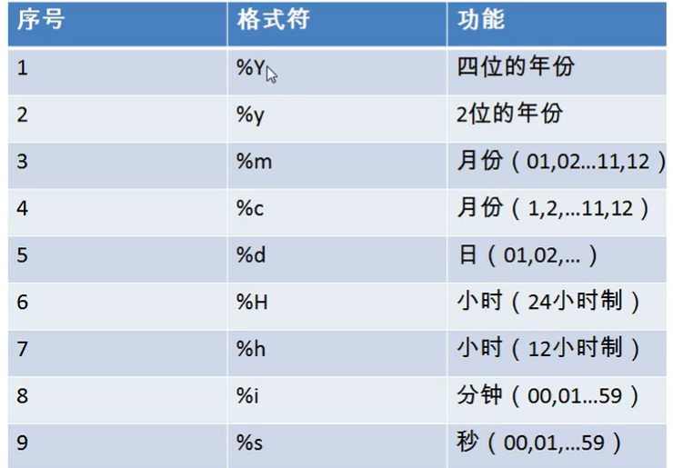

# 常见函数

### 函数分类

- 单行函数

&ensp;&ensp;&ensp;&ensp;字符函数

&ensp;&ensp;&ensp;&ensp;数学函数

&ensp;&ensp;&ensp;&ensp;日期函数

&ensp;&ensp;&ensp;&ensp;流程控制函数

&ensp;&ensp;&ensp;&ensp;其他函数

- 统计函数

[统计函数](%E7%BB%9F%E8%AE%A1%E5%87%BD%E6%95%B0/%E7%BB%9F%E8%AE%A1%E5%87%BD%E6%95%B0.md)

### 一：字符函数

#### length()

```SQL
# length() 获取参数的字节个数
select length('houdong');
select length('深渊');
 
# 查看字符集
show variables like '%char%';

```


#### concat()

```SQL
# concat 拼接字符串
select concat(last_name,'_',first_name) 姓名 
from employees;

```


#### upper(),lower()

```SQL
# upper,lower
select upper('hou');
select lower('HOU'); 

# eg:将姓大写，名小写然后拼接 (函数嵌套调用)
select concat(upper(last_name),lower(firet_name)) 姓名 
from employees;

```


#### substr(),subustring()

```SQL
# substr , substring
# 注意：在 sql 中，所有的引用都是从 1 开始的
# 截取从指定索引处后的所有字符
select substr('深渊凝望你',3) out_put;  # 凝望你
 
# 截取从指定索引处指定字符长度的字符
select substr('深渊凝望你',1,2) out_put;  # 深渊

# eg: 姓名中首字母大写，其他字母小写然后用 _ 拼接起来，显示出来
select concat(upper(substr(last_name,1,1)),'_',lower(substr(last_name,2)))  out_put;

```


#### instr(),trim()

```SQL
# instr
# 用于返回子串在大串中的第一次出现的索引，如果找不到就返回 0
select instr('深渊凝望你','凝望') as out_put;   # 3


# trim
# 用于去除前后的空格
select  length(trim('    hou   ')) as out_put; # 3

# 自定义去除 还可以是 ‘aa’,将其看成一个整体
select trim('a' from aaaaa侯aa栋aaaa);        #侯aa栋
```


#### lpad(),rpad()

```SQL
# lpad   向左填充指定长度
# rpad   向右填充指定长度
select lpad('hou',10,'@') as out_put; # @@@@@@@hou
 
select 人pad('12',11,'ab') as out_put; # 12ababababa
```


#### replace()

```SQL
# replace   替换
select replace('hou','u','h');  # hoh
select replace('houdongdong','o','i');  # hiudingding

```


### 二：数学函数

#### round()

```SQL
# round() 四舍五入
select round(1.65);  # 2
select round(-1.45);  # -1

# round(数字,保留位数)
select round(1.456,2)    # 1.6  
```


#### ceil()

```SQL
# ceil() 向上取整，返回 >=该参数的最小整数
select ceil(1.52)  # 2
select ceil(-1.2)  # -1 
```


#### floor()

```SQL
# floor 向下取整，返回 <= 该参数的最大整数
select floor(-9.99);  #-10 
select floor(9.99);   # 9

```


#### truncate()

```SQL
# truncate() 截断 （不进行四舍五入）
select truncate(1.65,1);  # 1.6
```


#### mod()

```SQL
# mod() 取余
# 注意这里结果的符号与被除数有关，与平时数学不一样
select mod(-10,3);     # -1    

select mod(a,b)  # 底层：  a-a/b*b

```


#### rand()

```SQL
# 获取随机数 返回 [0,1)之间的数
select  rand();
```


### 三：日期函数

#### now() ,curdate(),curtime()

```SQL
# now 返回当前系统日期+时间
select now();
 
# curdate() 返回当前日期，不包含时间
select curdate();

# curtime() 返回当前时间，不包含日期
select curtime();
 
 
# 可以指定得获取部分，年，月，日，小时，分钟，秒
select year(now()) 年;
select year(2002-03-23) 年;  # 这之间的间隔符不限
 
select month(now()); 
select monthname(now());   # 英文的月名

select minute(now());      # 分钟
select second(now());      # 秒
```


#### str_to_date() , date_format()

```SQL
# str_to_date()  将日期格式的字符转换为指定格式的日期
# 解析客户输入的日期要使用这个函数
select str_to_date('9-13-199','%m-%d-%Y');


# date_format()  将日期转化为字符
select date_format('2018/6/6','%Y年%m月%d日');
select date_format(now(),'%Y年%m月%d日');

```




#### datediff()

```SQL
# 返回两个日期之间相差的天数
```


### 四：其他函数

#### version() ,database(),user(),

```SQL
select version();  # mysql 版本信息
select database();  # 当前打开的数据库
select user();     # 当前用户
```


#### password()  

```SQL
# password() 返回字符的加密模式
但是在 mysql 8.0之后该函数移除  
```


#### md5() ,sha1()

```SQL
# md5() 返回该字符的md5加密模式  ,此加密模式不可逆
# sha1() 用来代替 password() 函数 
```


### 五：流程控制函数

#### IF() 

```SQL
# if() 是 if else的效果
select if(10>5,'大','小')；
select last_name,commission_pct,if(commection_pct is null,'没奖金','有奖金');
```


#### case  when  then  else  end

```SQL
# case  的 swith case的效果
/*
case 要判断的字段或表达式
when 常量1 then 要显示的值或语句,
...
else 要显示的值或语句,
end;

*/
/* 查询员工的工资
部门号 = 30 ,工资1.1倍;
部门号 = 40 ,工资1.2倍;
部门号 = 50 ,工资1.3倍;

其他 原工资;
*/

use myemployees;
select salary 原来工资,department_id 部门,
case department_id 
when 30 then salary*1.1 
when 40 then salary*1.2 
when 50 then salary*1.3 
else salary 
end as 新工资
from employees;
 
 
# case  的多重if效果
/*
case 
when  条件1  then 要显示的值1或语句1
when  条件2  then 要显示的值2或语句2
when  条件3  then 要显示的值3或语句3
else  要显示的值n或语句n
end
*/ 

/* 查询员工的工资
 如果工资 >20000,显示 A 级别
 如果工资 >15000,显示 B 级别
 如果工资 >10000,显示 C 级别
 否则 为 D 级别
*/ 
select salary ,
case 
when salary>20000 then 'A'
when salary>15000 then 'B'
when salary>10000 then 'D'
else 'D'
end as 工资级别
from employees;
```


