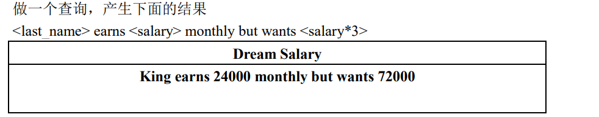
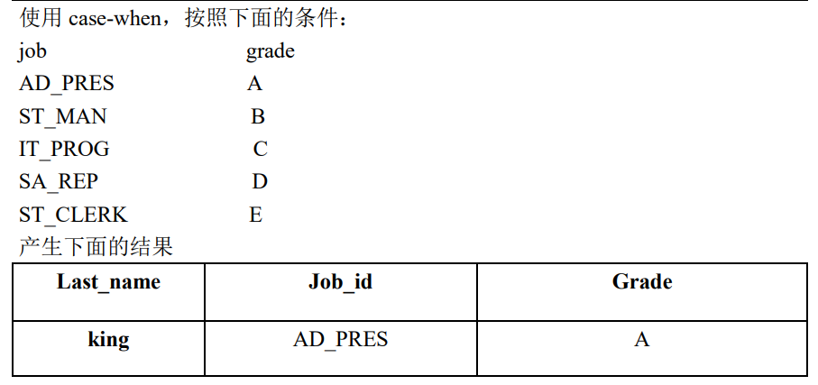

# 练习

```SQL
# 查看部门 departments 表的结构
desc departments; 


# 查询员工工号为 176 的员工的姓名和部门号及年薪

SELECT 
    last_name
    department_id
    salarys*12*(1+IFNULL(commission_pct,0)) AS 年薪 
FROM
    employees; 
    
    
# 查询部门 departments 表中涉及到哪些位置的编号

SELECT 
        DISTINCT location_id
FROM
        departments;  
        
        
        


# 面试题：
SELECT 
        *
FROM
        employees; 
        
--和

SELECT 
        *
FROM
        employees
WHERE
        commission_pct LIKE '%%' AND last_anme '%%';
--的结果是否一致  

--不一样
--如果没有 null 的话才一样
 
--或者改为 OR　也行
SELECT 
        *
FROM
        employees
WHERE
        commission_pct LIKE '%%' OR last_anme '%%'; 
        
        
        

# 选择工资不在 8000 到 17000 的员工的姓名和工资，按工资排序
select last_anme ,salarys
from employees
where not between 8000 and 17000
order by salary desc;


# 查询邮箱中的包含 e 的员工信息，并先按邮箱字节数降序，再按部门号升序
select *
from  employees
where email like '%e%'
order by length(email) desc,department_id asc;


# 查询员工工号，姓名，工资，以及工资提供20%后的结果
select employee_id,last_name,salary,salary*(1.2) "new salary"
from employees; 
  
  
# 将员工的姓名按首字母排序，并写出姓名的长度（length）
select length(last_name)长度,substr(last_name,1,1) 首字符,last_name
from employees
order by 首字符;

# 如果这里不按第一个字符排的话，默认的是先按第一个字符排，再依次按后面的排 
```




```SQL
select concat(Last_name,' earns ',salary,' monthly but wants ',salary*3) as DreamSalary
from employees
where salary <> 24000; 
```




```SQL
select job_id,
case job_id
when 'AD_PRES' then 'A'
when 'ST_MAN'  then 'B'
when 'IT_PROG' then 'C'
when 'SA_REP'  then 'D'
when 'ST_CLERK' then 'E'
end as 等级
from employees
where job_id is not null;
```


```SQL
# 查询员工最大入职时间和最小入职时间的差距天数（datediff())
select datediff(now(),'2017-9-19');

select datediff(max(hiredate) ,min(hireadte)) 


# 筛选部门编号为 90 得员工
select count(*)
from employees
where department_id = 90; 


# 查询各 job_id 的员工工资的最大值，最小值，平均值，总和，并按 job_id 升序
select max(salary),min(salary),avg(salary),sum(salary)
from employees
group by job_id
order by job_id; 


# 查询员工最高工资和最低工资的差距（DIFFERENCE）
select max(salary)-min(salary) difference
from employees; 


# 查询各个管理者手下员工的最低工资，其中最低工资不能低于 6000，没有管理者的员
# 工不计算在内
select 
      min(salary),
      manager_id
from employees
where manager_id is not null
group by manager_id
having min(salary)>=6000; 


# 查询所有部门的编号，员工数量和工资平均值,并按平均工资降序
select 
      avg(salary),
      department_id,
      count(*)
from 
      employees
# group by department_id,count(*)   # group by 后面不能跟 count(*)

group by department_id
order by avg(salary) asc; 


# 选择具有各个 job_id 的员工人数
select 
      count(*),
      job_id
from 
      employees
group by job_id;  


# 显示员工表的最大工资
select max(salary) from employees; 


# 查询员工表的employee_id , job_id ,last_name 按照department_id降序，
# salary 升序
select 
      employee_id ,
      job_id,
      last_name
from 
      employees
order by 
      department_id desc,
      salary asc  
      
      
# 查询员工表种 job_id 中包含 a 和e的,并且 a 在 e 的前面
select 
        job_id,
from
        employees
where 
        job_id like '%a%e%'; 
        
        
        
        
        
# 已知表 student 里面有 id(学号)，name(姓名)，gradeId(年纪编号)
# 已知表 grade,里面有id（年级编号），name(年级名)
# 已知表result,里面有 id score studentNo(学号)
select 
        s.name,
        g.name,
        r.score
from 
        student s,
        grade g,
        result r
where 
        s.id = r.studentNo
and
        g.id =  s.gradeId; 
        
        
        
# 显示当前日期，以及去前后空格，截取子字符串的函数
select  trim(now());   # trim()要去指定字符就是 trim('a' from '要去a的参数') 


# 显示所有员工的姓名，部门号和部门名称。
use myemployees;
select 
      last_name,
      d.department_id,
      department_name
from 
      employees as e,
      departments as d
where  
      e.department_id = d.department_id; 
      
      
      
# 查询 90 号部门员工的 job_id 和 90 号部门的 location_id
select 
        job_id,
        location_id
from 
        departments as d,
        employees as e
where  
        e.department_id = d.department_id
and 
        e.department_id = 90; 
        
        
        
# 选择所有有奖金的员工的 last_name , department_name , 
# location_id , city
select 
      last_name,
      department_name,
      l.location_id,city
from 
      employees as e,
      departments as d,
      locations as l
where 
      e.department_id = d.department_id
and   
      d.location_id = l.location_id
and   
      e.commission_pct is not null; 
      
      
      
      
      
# 选择city在Toronto工作的员工的
# last_name , job_id , department_id , department_name
select 
      last_name ,
      job_id,
      d.department_id,
      department_name
from 
      employees as e,
      departments as d,
      locations as l
where  
      e.department_id = d.department_id
and   
      d.location_id = l.location_id
and 
      city = 'Toronto'; 
      
      
      
# 查询每个工种、每个部门的部门名、工种名和最低工资
select 
        job_title,
        job_id,
        department_name,
        min(salary)
from 
        jobs as j,
        employees as e,
        departments as d
where 
        e.department_id = d.department_id
and   
        e.job_id = j.job_id
        
# 由于上述条件查完之后出现了新表，并且在 select 后面的哪些元素的行数并不一样，
# 所以我们可以添加几个行数一致的字段来为作为新表的字段

group by department_name,job_title; 
  
  
  
  
# 查询每个国家下的部门个数大于 2 的国家编号
select 
      country_id,
      count(*) as 部门个数
from 
      departments as d,
      locations as l
where 
       d.location_id = l.location_id
       
# 在此处要求国家编号 >2 ,那么首先要按国家编号分组之后再添加筛选条件
group by  country_id
having count(*)>2; 


# 选择指定员工的姓名，员工号，以及他的管理者的姓名和员工号，结果类似于下面的格式
#  employees   Emp#    manager    Mgr#
#  kochhar      101     king       100
select 
      e.last_name   as employees,
      e.employee_id as "Emp#",
      m.last_name   as manager,
      m.employee_id as "Mgr#"
from 
      employees as e,
      employees as m
where
      e.manager_id = m.employee_id
and 
      e.last_name = 'Kochhar'; 
      
      
# 查询编号>3 的女神的男朋友信息，如果有则列出详细，如果没有，用 null 填充
select 
      bo.*,
      b.*
from beauty as b
left join boys as bo
on b.boyfriend_id = bo.id
where b.id > 3;


# 查询哪个城市没有部门
select 
      city,
      d.*
from 
      locations as l
left join departments as d
on d.location_id = l.location_id
where d.department_id is null;     # 注意这里是 从表的
  
  
  
# 查询部门名为 SAL 或 IT 的员工信息
# 注意这里如果用内连接的话 有可能这两个部门中没有员工，这就不会被查出,
# 刚开始我用的内连接，然后就少了两个 null 的
select
      e.*,
      department_name
from 
      departments as d
left join employees as e
on e.department_id = d.department_id
where d.department_name in('SAL','IT'); 


# 查询和 Zlotkey 相同部门的员工姓名和工资 （标量子查询）

# 先查Zlotkey的部门
select department_id
from employees 
where last_name = 'Zlotkey';

# 再查与其相同部门的员工姓名和工资
select last_name,
       salary
from employees
where  department_id = (
      select department_id
      from employees 
      where last_name = 'Zlotkey'
); 
 
 
 
# 查询工资比公司平均工资高的员工的员工号，姓名和工资。
select avg(salary)
from employees;


select department_id,
       last_name,
       salary
from employees
where salary > (
    select avg(salary)
    from employees
    ); 
    
    
# 查询各部门中工资比本部门平均工资高的员工的员工号, 姓名和工资
# ①：先查各部门的平均工资
select avg(salary),
       department_id
from employees
group by department_id;


# ②：连接①结果集和employees表，进行筛选
select employee_id,
       last_name,
       salary
from employees as e
inner join(
        select avg(salary) as ag,
           department_id
    from employees
    group by department_id
    ) as dep_avg_sal
on e.department_id = dep_avg_sal.department_id
where salary>dep_avg_sal.ag; 


# 查询和姓名中包含字母 u 的员工在相同部门的员工的员工号和姓名
select distinct department_id
from employees
where last_name like '%u%';


select employee_id,
       last_name
from employees
where department_id in(
    select distinct department_id
    from employees
    where last_name like '%u%'
    );  
    
    
# 查询在部门的 location_id 为 1700 的部门工作的员工的员工号
select distinct department_id
from departments
where location_id = 1700;

select employee_id
from employees
where employees.department_id in(
    select distinct  departments.department_id
    from departments
    where location_id = 1700
    ) 
     
     
     
# 查询管理者是 K_ing 的员工姓名和工资
# 这里需要清楚的一点就是我们管理者有 manager_id 并在有 last_name
# 所以我们 管理者和员工之间一定要分清楚

# 查询姓名为 K_ing 的员工编号
select employee_id
from employees
where last_name = 'K_ing';

# 查询那个员工的 manager_id = ①
select last_name,
       salary
from employees
where manager_id in(
    select employee_id
    from employees
    where last_name = 'K_ing'
    );
    
    
  
# 查询工资最高的员工的姓名，要求 first_name 和 last_name 显示为一列，列名为 姓.名
select max(salary)
from employees;


select concat(first_name,' ',last_name) as '姓名'
from employees
where salary = (
    select max(salary)
    from employees
    ); 
```


```SQL
已知表 stuinfo
id 学号
name 姓名
email 邮件   john@126.com
gradeId  年级编号
sex 性别
age 年龄

已知表 grade
id 年纪编号
gradeName 年纪名称

# 一： 查询 所有学员的邮箱的用户名（注：用户名为邮箱中 @前的字符）
select substr(email,1,instr(email,'@')-1) 用户名
from stuinfo;


# 二：查询男生和女生的个数
select count(*) 个数，sex
from stuinfo
group by sex;


# 三：查询年龄 >18岁的所有学生的姓名和年级名称
select name,gradeName
from stuinfo as s
inner join grade as g
on s.gradeId = g.id
where age>18

# 四：查询哪个年级的学生最小年龄 >20岁
select min(age),gradeId
from stuinfo 
group by gradeId
having min(age)>20


# 五：试说出查询语句中涉及到的所有关键字，以及执行先后顺序 

 select 查询列表                七
 
 from 表1                      一
                 
 (连接类型) join  表2           二
 
 on 连接条件                    三
 
 where 筛选条件                 四
  
 group by 分组列表              五
 
 having 分组后的筛选             六 
 
 order by 排序列表              八
 
 limit 偏移                     九
```


