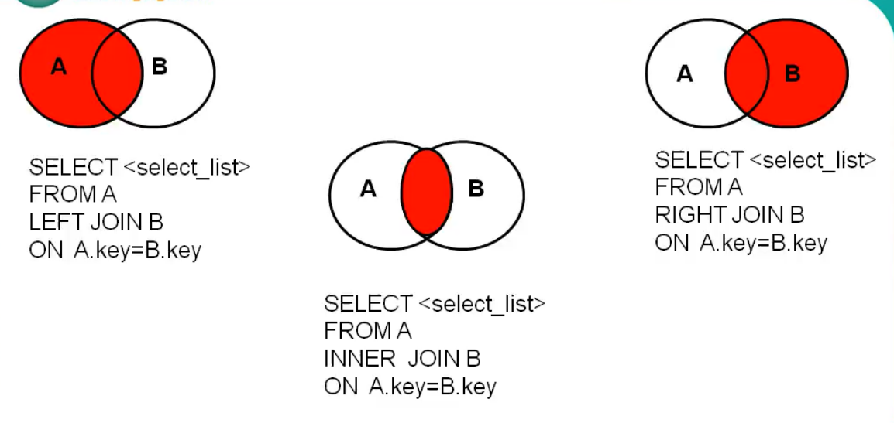

# 连接查询

又称多表查询，或多表连接

什么时候使用？

- 当我查询的字段来源于多个表时，就会用到连接查询

分类：

- 按年代分

&ensp;&ensp;&ensp;&ensp;sql 92标准 ：仅支持内连接

&ensp;&ensp;&ensp;&ensp;sql 99标准 ：不支持全外连接

- 按功能分

&ensp;&ensp;&ensp;&ensp;内连接

&ensp;&ensp;&ensp;&ensp;外连接

&ensp;&ensp;&ensp;&ensp;交叉连接

```SQL
# 笛卡尔乘积的错误情况：表 1 有 m 行，表二有 n 行 ，结果= m * n 行
# 原因在于没有有效的连接条件
# 所以要添加有效的连接条件

# 查找对应男朋友
use girls;
select name,boyName from boys,beauty
where beauty.boyfriend_id = boys.id;
```


### sql 92内连接

#### 1：等值连接

1. 连接条件

2. 关于表的限定

3. 关于别名

4. 关于添加筛选条件

5. 关于添加分组

6. 关于添加排序

7. 三表连接

#### 等值连接关键因素

- 多表等值连接的结果为多表交集的部分

- n 表连接，至少 n-1 个连接条件

- 多表的顺序没有要求

- 一般需要为表取别名

- 可以搭配前面介绍的所有字句使用，eg：分组（group by ）排序 (order by ) 筛选(where)

#### 等值连接基本语法

```SQL
select 查询列表
from  表1  别名, 表2 别名
where  表1.key = 表2.key  
【and 筛选条件】
【group by 分组字段】
【having 分组后的筛选】
【order by 排序字段】 
```


```SQL
# 查询女神名和对应的男神名
select name,boyName
from boys,beauty
where beauty.boyfriend_id = boys.id;
# 等值连接这里会根据连接条件进行审查

# 查询员工名和对应的部门名
use myemployees;
select last_name,department_name
from employees,departments
where employees.`department_id` = departments.`department_id`;


# 查询员工名，工种号，工种名
# 反复的使用表名去限定，这会是程序很复杂，这时候可以起别名
select last_name,employees.job_id,job_title
from employees,jobs
where employees.job_id =  jobs.job_id;

# Error Code: 1052. Column 'job_id' in field list is ambiguous  
# 字段列表中的“job_id”列不明确 
# 即没有使用 employees.  去限定的话，jod_id 不知道取哪个


# 注意点：如果为 表 起了别名，那么查询的字段就不能使用原来的表明去限定了

select 
    last_name,e.job_id,j.job_title
from 
    employees as e,jobs as j     
# 这两个表的顺序可以替换，因为先加载的一张表会去通过连接条件去匹配下一表，
# 所以连接条件是关键，而顺序不重要
where 
    e.job_id  =  j.job_id
    
    
# 添加筛选条件
# 查询有奖金的员工名，部门名
select last_name,department_name,commission_pct
from employees as e,departments as d
where e.`department_id` = d.`department_id`
and e.`commission_pct` is not null;


# 查询城市名中第二字符为 o 的部门名和城市名

# 分析：首先是筛选条件：第二字符为 o 城市名，然后是两张表 部门名和城市名，再由连接条件
# 因为两张表中要通过 城市名去匹配部门名，所以找到筛选条件要的城市名后找到对应的部门名
# 再与部门名进行（连接条件）匹配，一致就输出
select city,department_name 
from departments as d,locations as l
where  d.location_id = l.location_id
and city like '%o%';
 
 
# 添加分组
# 查询每个城市的部门个数
select count(*) as 个数,city
from departments d,locations l
where d.location_id = l.location_id
group by city;


# 查询有奖金的每个部门 的部门名 和 部门领导编号 和该部门 的最低工资
select 
      department_name,
      manager_id,
      min(salary)
from 
      employees as e,
      departments as d
where 
      d.department_id = e.department_id
and
       commission_pct is not null
group by 
       department_name,d.manager_id;


# 添加排序
# 查询每个工种的工种名和员工的个数，并且按员工个数进行降序
select 
      count(*),
      job_title
from   
      employees e,
      jobs j
where 
      e.`job_id` = j.`job_id`
group by job_title
order by count(*) desc;


 
# 三表连接
#  查询员工名，部门名和员工和部门所在城市
#  分析：这个的来来连接条件在于要找三张表种由人名匹配的部门和城市
#   所以 部门编号 和 城市编号 就是连接关键
select
      last_name,
      department_name,
      city
from   
      employees as e,
      departments as d,
      locations as l
where e.department_id = d.department_id
and   d.location_id = l.location_id; 


select
      last_name,
      department_name,
      city
from   
      employees as e,
      departments as d,
      locations as l
where e.department_id = d.department_id
and   d.location_id = l.location_id
# 再加些要求
and   city like '%s%'
order by department_name desc;

 
```


#### 2：非等值连接

常用于一个值 和这个值的几个标准进行比较等到一个等级或结果（range）

#### 非等值连接基本语法

```SQL
select 查询列表
from  表1  别名, 表2 别名
where  表1.key  除了等于号的其他比较符号  表2.key  
【and 筛选条件】
【group by 分组字段】
【having 分组后的筛选】
【order by 排序字段】
```


```SQL
# 查询员工的工资和工资级别
select salary,grade_level
from employees as e,job_grades as g
where salary between g.lowest_sal and  g.highest_sal;


# 对上述例子再添加一些限制条件
# 找到工资为 A 级的并且进行升序排列
select salary,grade_level
from employees as e,job_grades as g
where salary between g.lowest_sal and  g.highest_sal
and grade_level = 'A'
order by salary asc;


由下面的图可以看出 需要salary 和 lowest_sal 和 highest_sal去比较，以得出等级

```


#### 3：自连接

#### 自连接基本语法

```SQL
select 查询列表
from  表  别名1, 表 别名2
where  等值连接条件 
【and 筛选条件】
【group by 分组字段】
【having 分组后的筛选】
【order by 排序字段】
```


```SQL
# 由上面表可以得到当我们需要去比较一张表中不同的值时，我们需要对表进行两次查看
# 这就是自连接

# 查询 员工名 和 上级的 名称
select 
      e.employee_id,
      e.last_name,
      m.employee_id,
      m.last_name
from 
      employees e,
      employees m
where 
      e.manager_id = m.employee_id;
      

```


### sql 99 




#### 基本语法

```SQL
select 
      查询列表
from 
      表1 as 别名 【连接类型】
join 
      表2 as 别名 
on    
      连接条件    
【where 筛选条件】 
【group by 分组】
【having 筛选条件】
【order by 排序列表】
【limit 子句】

连接类型
    内连接 ： inner
    外连接
        左连接：left 【outer】
        右连接：right【outer】
        全外：  full 【outer】 
     交叉连接： cross  
```


### 内连接

```SQL
/*
select 
      查询列表
from 
      表1 as 别名 inner
join 
      表2 as 别名 
on    
      连接条件  
        
【where 筛选条件】 
【group by 分组】
【having 筛选条件】
【order by 排序列表】

注意： inner 可以省略
      筛选条件在 where 后面，连接条件放在 on 后面     

*/
```


#### 1：等值连接

```SQL
# 查询员工名，部门名（调换位置）
select 
      last_name,
      department_name
from
      employees as e  inner join departments as d
on 
      e.department_id = d.department_id;


# 查询名字中包含 e 的员工名和工种名（筛选）
select 
      last_name,
      job_title
from
      employees as e inner join jobs as j
on 
      e.job_id = e.job_id
where
      e.last_name like '%e%';


# 查询部门个数 >3的城市名 和 部门个数
select
      city,
      count(*)
from
      locations as l inner join departments as d
on
      l.location_id = d.location_id
group by city
having
      count(*)>3;
 
      
# 查询哪个部门部门员工个数 >3 的部门名 和 员工个数，并按照个数降序
select 
      count(*),
      department_name
from
      employees as e inner join departments d
on e.department_id = d.department_id
group by department_name
having count(*)>3
order by count(*)desc;

# 查询员工名，部门名，工种名，并按部门名降序 （三表连接）
select
       last_name,
       department_name,
       job_title
from
        employees as e 
        inner join departments as d 
on      e.department_id = d.department_id
        inner join jobs as j
on      e.job_id = j.job_id

order by department_name desc;
        
# 上面这个多表查询一定要注意from 后面的顺序
对于 jobs 和 employees 这两者之间没有连接条件，所以我们必须先将有连接条件的
先写出来    
```


#### 2：非等值连接

```SQL
# 查询员工的工资级别
select 
      salary,
      grade_level
from
      employees as e inner join
      job_grades as  g
on 
      e.salary between g.lowest_sal and g.highest_sal;


# 查询工资级别的员工个数>2的 工资级别 和 员工个数，并且按工资级别降序
select 
      salary,
      grade_level,
      count(*)
from
      employees as e inner join
      job_grades as  g
on 
      e.salary between g.lowest_sal and g.highest_sal
group by grade_level
having count(*)>2
order by  grade_level desc;
```


#### 3：自连接

```SQL
# 查询姓名中包含 k 字符的员工的名字，上级的名
select e.last_name ,m.last_name
from employees as e
inner join  employees as m
on e.manager_id = m.employee_id
where e.last_name like '%k%';

```


### 外连接


```SQL
# 上述表分析：这里使用 beauty 表去匹配 boys 表，匹配的依然是 boyfriend_id 和 id,
# 此时如果能找就匹配，找不到就自动匹配 null
# 要注意的是外连接是分主从表的，那么此时 beauty 为主表，boys 为从表，此时会根据主表去列出一个对应表
# 第二张图就是对应表
# 左外连接
select 
      b.name,
      bo.*
from 
      beauty as b
left outer join boys as bo
on b.boyfriend_id = bo.id
# 加条件

where bo.id is not null;  # 这里加的条件也是很特殊，因为此时的id 是 非 null 的

# 右外连接
select
      b.name,
      bo.*
from
      boys as bo
right outer join  beauty as b
on b.boyfriend_id = bo.id
where bo.id is  not null;

# 换主从表
select
      b.*,
      bo.*
from
      boys as bo
left outer join  beauty as b
on b.boyfriend_id = bo.id
where b.id is not null;

其应用就是查询一个表中有，另一个表中没有的记录
    特点：
 1：外连接的查询结果 为主表中的所有记录
     如果 从表中有和主表匹配的，则显示匹配的值（此时的匹配就类似于 连接条件，但又不同）
     如果 从表中没有和主表匹配的，则显示 null 值
     外连接的查询结果 = 内连接结果  + 主编中有而从表中没有的记录
 2：左外连接： left  join 左边的是主表
    右外连接： right  join右边的是主表

 3：左外和右外交换两个表的顺序，可以实现同样的效果
```


#### 1：左外连接，右外连接

```SQL
# 查询一下那个部门没有员工
# 左外
select 
      d.*,
      e.employee_id
from 
      departments as d
left outer join employees as e
on d.department_id = e.department_id
where e.employee_id is null
    
# 右外
select
      d.*,
      e.employee_id
from
     employees as e
right join   departments as d
on d.department_id = e.department_id
where e.employee_id is not null;   
```


#### 2：全外连接

```SQL
# mysql 并不支持
其达到的效果就是：
    全外连接 = 内连接结果 + 表一中有但表二中没有 + 表一中没有但表二中有


use girls;
select b.*,bo.*
from beauty as b
full outer join boys as bo
on b.boyfriend_id = bo.id; 
```


### 交叉连接

```SQL
# 就是笛卡尔乘积
select
      b.*,
      bo.*
from 
      beauty as b
cross join boys as bo; 
```


